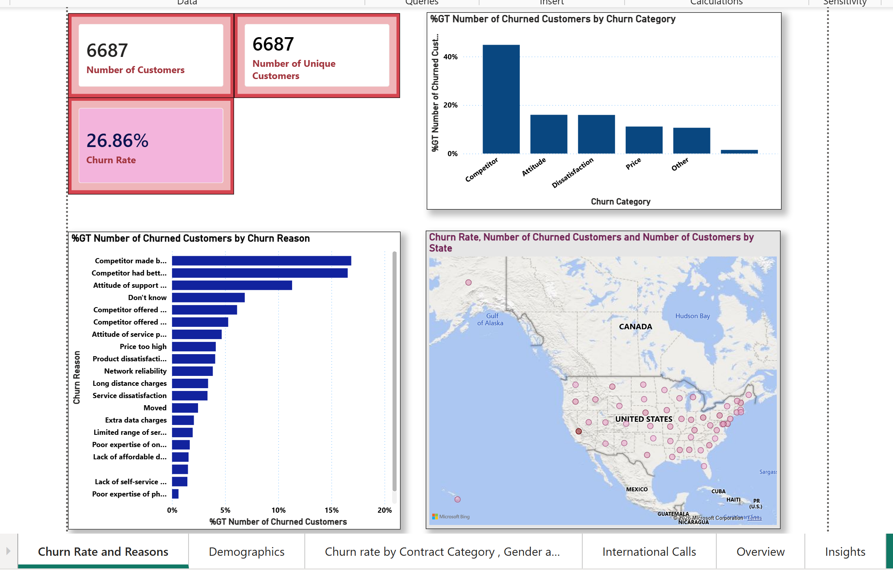
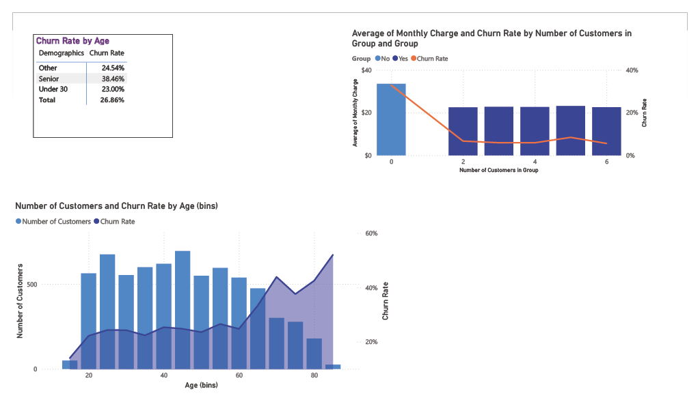
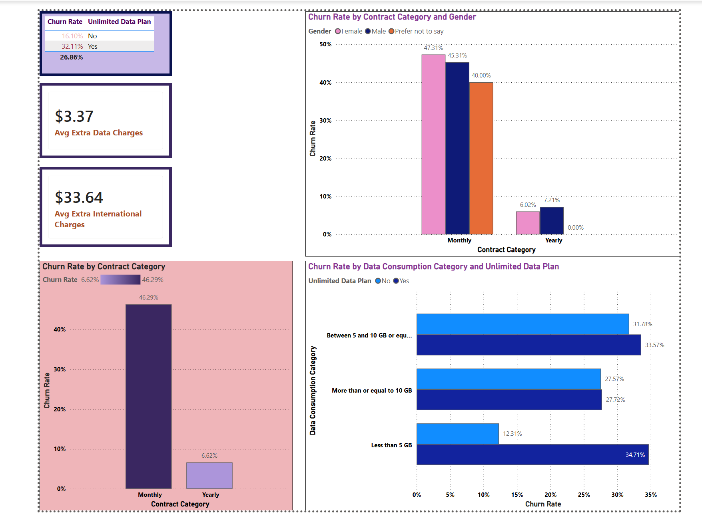
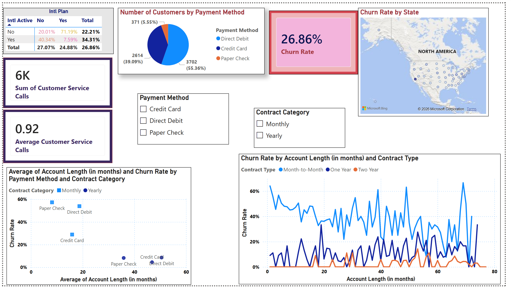
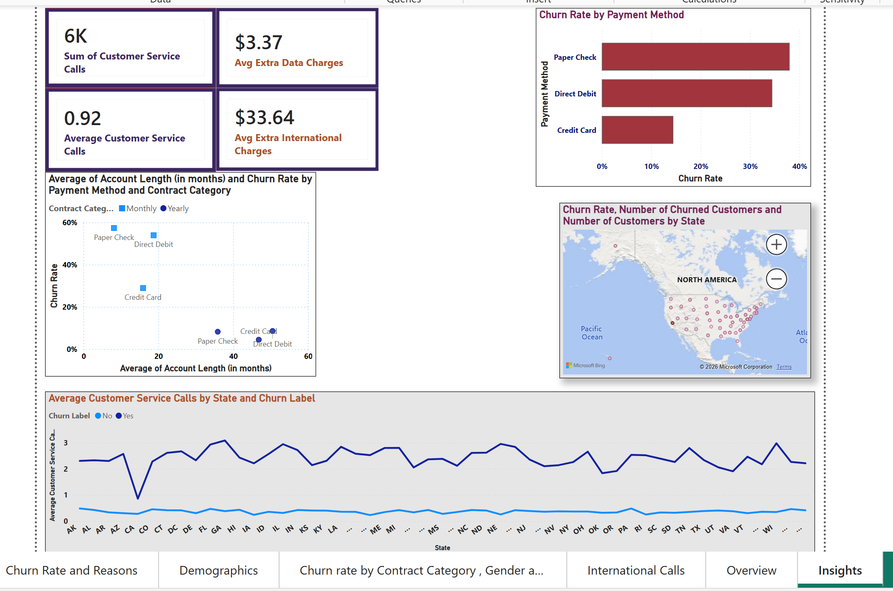

# Customer Churn Analysis using Power BI 

## 📊 Project Overview
Interactive 6-page Power BI dashboard analyzing customer churn for a telecom company with **6,687 customers**. Identifies key churn drivers across demographics, contract type, data usage, geography, international plan behavior, and payment method to help the business devise targeted retention strategies.

**Overall Churn Rate: 26.86% (1,796 out of 6,687 customers)**

## 🎯 Business Objective
Reduce customer churn by identifying high-risk customer segments and uncovering behavioral, demographic, contractual, and geographic churn drivers.

## 🛠️ Tools & Techniques
- **Power BI Desktop** — Multi-page dashboard, interactive visuals, map filters
- **Power Query** — Data cleaning, type corrections, duplicate validation
- **DAX** — KPI measures, calculated columns, segmentation logic

---

## 📁 Dashboard Pages

| Page | Focus |
|---|---|
| Churn Rate and Reasons | Overall KPIs, churn by category and reason, geographic map |
| Demographics | Churn by age bins, senior status, group size, monthly charge |
| Contract, Gender & Data | Churn by contract type, gender, unlimited plan, data consumption |
| International Calls | Churn by international plan activity, payment method, account length |
| Overview | Executive summary — all key insights in one view |
| Insights | Customer service calls, payment method churn, account length trends |

---

## 🔑 Key Findings & Business Recommendations

### 📍 Geographic
- **California has the highest churn rate at 63.24%**
- 72% of California churners are internationally active but have no international plan — being overcharged for calls and leaving
- **Recommendation:** Proactively offer international plans to California customers making international calls

### 👥 Demographics
- **Seniors churn at 38.46%** — highest demographic group
- Under 30 customers churn at only **23%**
- Churn increases with age, accelerating after 65
- **Group of 6 customers churn at just 5%** — highest loyalty
- Individual plan customers churn significantly more than group plan customers
- **Recommendation:** Senior retention offers; incentivize group plan upgrades

### 📋 Contract Type
- **Monthly contracts: 46.29% churn** — nearly 1 in 2 leave
- **Yearly contracts: 6.62% churn** — highly loyal
- Gender has minimal impact within contract types:
  - Monthly → Female: 47.31%, Male: 45.00%
  - Yearly → Female: 6.02%, Male: 7.21%
- **Recommendation:** Offer discounts to monthly customers to switch to yearly

### 📶 Data Usage & Unlimited Plan
- Unlimited plan customers churn at **32.11%** vs **16.10%** without
- Within unlimited plan customers by data consumption:
  - **Less than 5 GB: 34.71% churn** — paying for unlimited but not using it
  - **5–10 GB: 33.57% churn**
  - **10 GB or more: 27.72% churn** — getting value, most satisfied
- **Recommendation:** Offer unlimited plan customers using less than 5 GB a cheaper limited plan

### 🌍 International Plan
- Customers with **international plan but NOT using it: 71.19% churn** — highest risk segment
- Customers **making international calls without a plan: 40.34% churn** — being overcharged
- Customers **with plan AND actively using it: only 7.59% churn**
- **Recommendation:**
  1. Proactively remove international plan from inactive users
  2. Offer international plan to active callers without one

### 💳 Payment Method & Customer Service
- **Paper Check: 38.01% churn** — 55.36% of all customers pay this way
- **Direct Debit: 34.49% churn** — 5.55% of customers
- **Credit Card: 14.46% churn** — 39.09% of customers, most loyal
- Average customer service calls per customer: **0.92**
- Total customer service calls: **6,000+**
- Average extra data charges: **$3.37**
- Average extra international charges: **$33.64**
- **Recommendation:** Incentivize credit card or auto-pay enrollment; customers on automated payment churn significantly less

### 📅 Account Length
- Churn rate decreases as account length increases — longer tenure means more loyal customers
- Monthly contract customers show high churn volatility regardless of tenure
- Yearly contract customers stabilize quickly after first renewal
- **Recommendation:** Focus retention on new customers in first 12 months, especially on monthly contracts

---

## 📐 DAX Measures Created
```
Churn Rate = DIVIDE([Number of Churned Customers], [Number of Customers], 0)
Number of Churned Customers = SUM(Churn_fact[Churned])
Number of Customers = COUNT(Churn_fact[Customer ID])
Number of Unique Customers = DISTINCTCOUNT(Churn_fact[Customer ID])
Average Customer Service Calls = AVERAGE(Churn_fact[Customer Service Calls])
Avg Extra Data Charges = AVERAGE(Churn_fact[Extra Data Charges])
Avg Extra International Charges = AVERAGE(Churn_fact[Extra International Charges])
```

---

## 🧮 Calculated Columns Created

- `Churned` — Converts churn label into binary flag

```DAX
IF(Churn_fact[Churn Label] = "Yes", 1, 0)
```

- `Contract Category` — Groups contract types into Monthly and Yearly

```DAX
SWITCH(
    Churn_fact[Contract Type],
    "One Year", "Yearly",
    "Two Year", "Yearly",
    "Month-to-Month", "Monthly",
    "Other"
)
```

- `Data Consumption Category` — Groups customers by average monthly data usage

```DAX
SWITCH(
    TRUE(),
    ISBLANK('Churn_fact'[Avg Monthly GB Download]), "Other",
    'Churn_fact'[Avg Monthly GB Download] < 5, "Less than 5 GB",
    'Churn_fact'[Avg Monthly GB Download] < 10, "Between 5 and 10 GB",
    'Churn_fact'[Avg Monthly GB Download] >= 10, "More than or equal to 10 GB"
)
```

- `Demographics` — Classifies customers into age-based demographic groups

```DAX
IF(
    'Churn_fact'[Under 30] = "Yes",
    "Under 30",
    IF(
        'Churn_fact'[Senior] = "Yes",
        "Senior",
        "Other"
    )
)
```

- `Age (bins)` — Age grouping for trend analysis

## 🧹 Data Cleaning (Power Query)
- Verified zero duplicate customer records (Total = Unique = 6,687)
- Corrected data types for all numeric and categorical columns
- Validated data quality before analysis

---

## 💡 Business Recommendations Summary

| Segment | Issue | Recommendation |
|---|---|---|
| California customers | Intl active, no plan | Proactively offer international plan |
| Monthly contract customers | 46.29% churn | Discount to switch to yearly |
| Seniors (65+) | 38.46% churn | Targeted senior retention offers |
| Unlimited plan, <5GB users | 34.71% churn | Offer downgrade to limited plan |
| Paper check payers (55% of customers) | 38.01% churn | Incentivize auto-pay/credit card |
| Intl plan, not active | 71.19% churn | Proactively remove unused plan |
| Individual plan customers | High churn | Incentivize group plan upgrades |

## 📸 Dashboard Screenshots

### Overview


### Churn Rate and Reasons


### Demographics


### Contract, Gender & Data Consumption


### International Calls


### Insights



