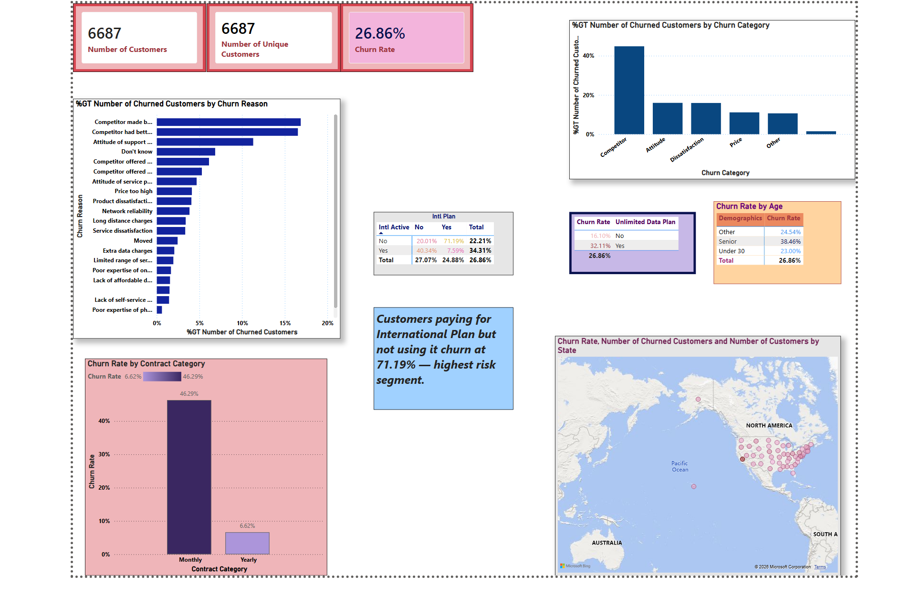

# Customer Churn Analysis using PowerBI
Power BI dashboard analyzing customer churn for a telecom company. Identifies key churn drivers across demographics, contract type, data usage, and geography using DAX measures and Power Query.

